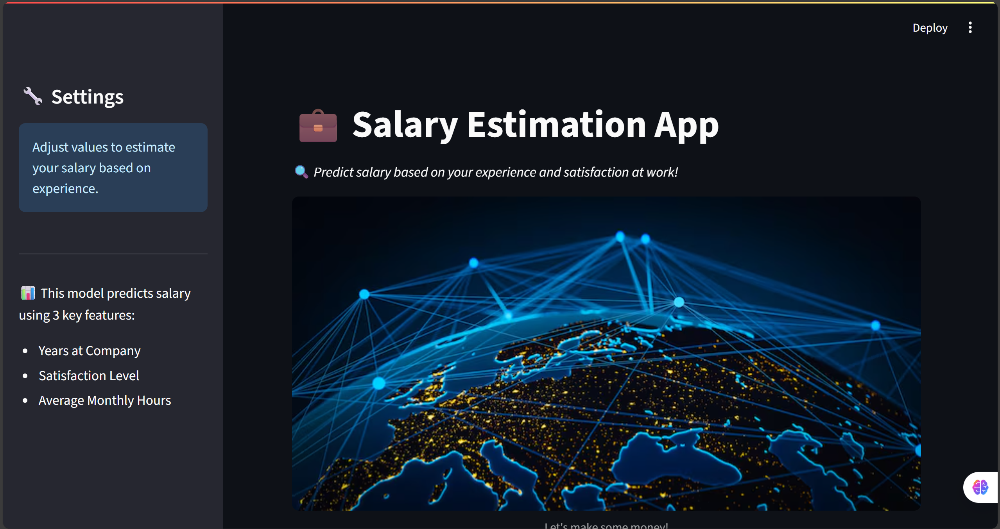
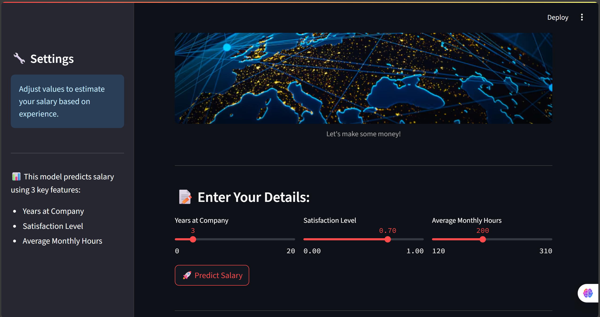
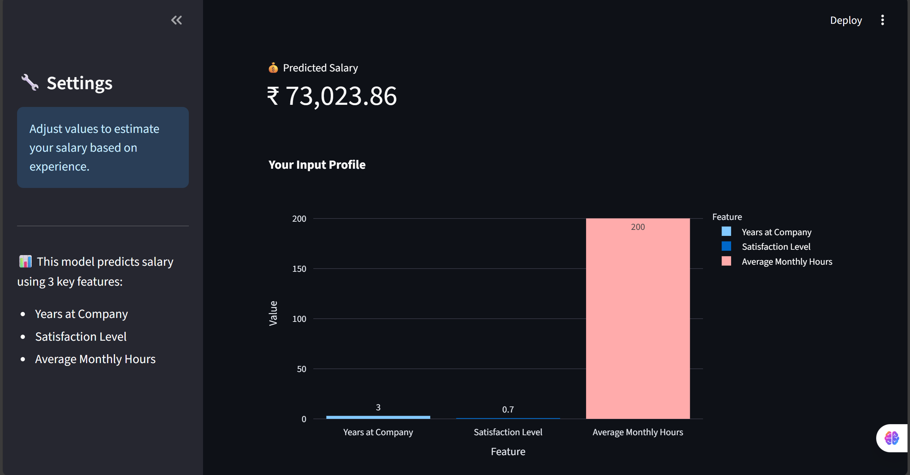
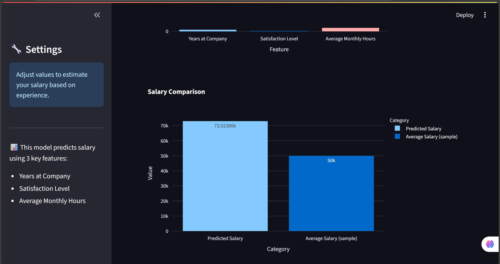

# 💼 Salary Estimation Web App

This is an interactive **Streamlit** web application that predicts an employee's estimated **salary** based on:

- 🔢 Years at the company  
- 🙂 Satisfaction level  
- ⏱️ Average monthly hours  

The app uses a pre-trained **Machine Learning model** and provides a visual comparison of predicted vs. average salary using **Plotly** charts.

---

## 🖼️ App Preview

### 🎯 Main Interface


### 📝Adding details


### 📊 Prediction Result and Chart


### 📈Salary Comparision📉


---

## 📦 Tech Stack

| Tool         | Purpose                      |
|--------------|------------------------------|
| Python       | Core programming language    |
| Streamlit    | Web UI framework             |
| Scikit-learn | Machine Learning model       |
| Joblib       | Load serialized models       |
| Pandas       | Data handling                |
| Numpy        | Numerical operations         |
| Plotly       | Interactive visualizations   |

---


---

## 🛠️ How to Run Locally

1. **Clone the repo**  
   ```bash
   git clone https://github.com/your-username/salary-estimator.git
   cd salary-estimator
   
2. **Install the dependencies**
   ```bash
   pip install -r requirements.txt

3.**Run the app**
   ```bash
   streamlit run app.py
   ```
---

## 🧠 Model Info
The ML model is trained using features from employee records. It was trained offline using Scikit-learn and serialized using Joblib.

---

## 🌐 Deployment
This app can be deployed easily on:

1. Streamlit Cloud
2. Render
3. Hugging Face Spaces

---

## 🙌 Acknowledgements
Freepik for the banner image

Streamlit Docs for excellent guidance

Scikit-learn for machine learning support

